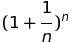

# libeuler

`libeuler` calculates an approximation of the base `e` of the [natural logarithm](https://en.wikipedia.org/wiki/Natural_logarithm).

### Method
The approximation is done using the equation  where the value of `e` gets more accurate as `n` gets bigger and bigger.

### Dependencies
* [libexponent](https://github.com/mathinjenkins/libexponent)

### Build
* `git clone git@github.com:mathinjenkins/libeuler.git`
* `cd libeuler`
* `mkdir build && cd build`
* `cmake ../`
* `make`
* `./test/euler_test`

### License
[MIT License](https://github.com/mathinjenkins/libeuler/blob/master/LICENSE)
